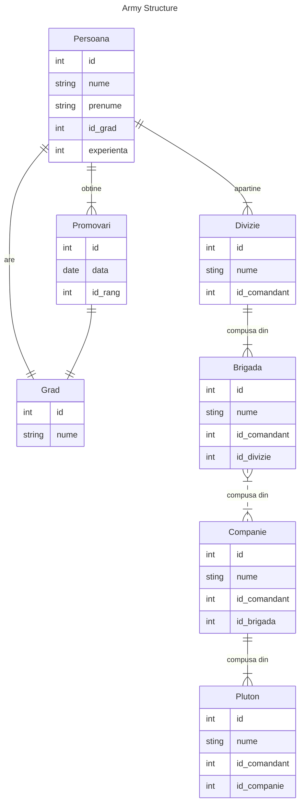

# Army-ERD
Army Data Wearhouse ERD

```mermaid
---
title: Army Structure
---
erDiagram
  
  Persoana{
        int id
        string nume
        string prenume
        int id_grad
        int experienta
  }
  Grad{
    int id
    string nume

  }
  Promovari{
    int id
    date data
    int id_rang
  }
  Divizie{
    int id
    sting nume
    int id_comandant
  }
  Brigada{
    int id
    sting nume
    int id_comandant
    int id_divizie
  }
  Companie{
    int id
    sting nume
    int id_comandant
    int id_brigada
  }
  Pluton{
    int id
    sting nume
    int id_comandant
    int id_companie
  }
  Persoana ||--|{ Divizie : apartine
  Persoana ||--|| Grad : are
  Persoana ||--|{ Promovari : obtine
  Promovari ||--|| Grad : ""
  Divizie ||--|{ Brigada : "compusa din"
  Brigada }|..|{ Companie : "compusa din"
  Companie ||--|{ Pluton : "compusa din"
  
```
