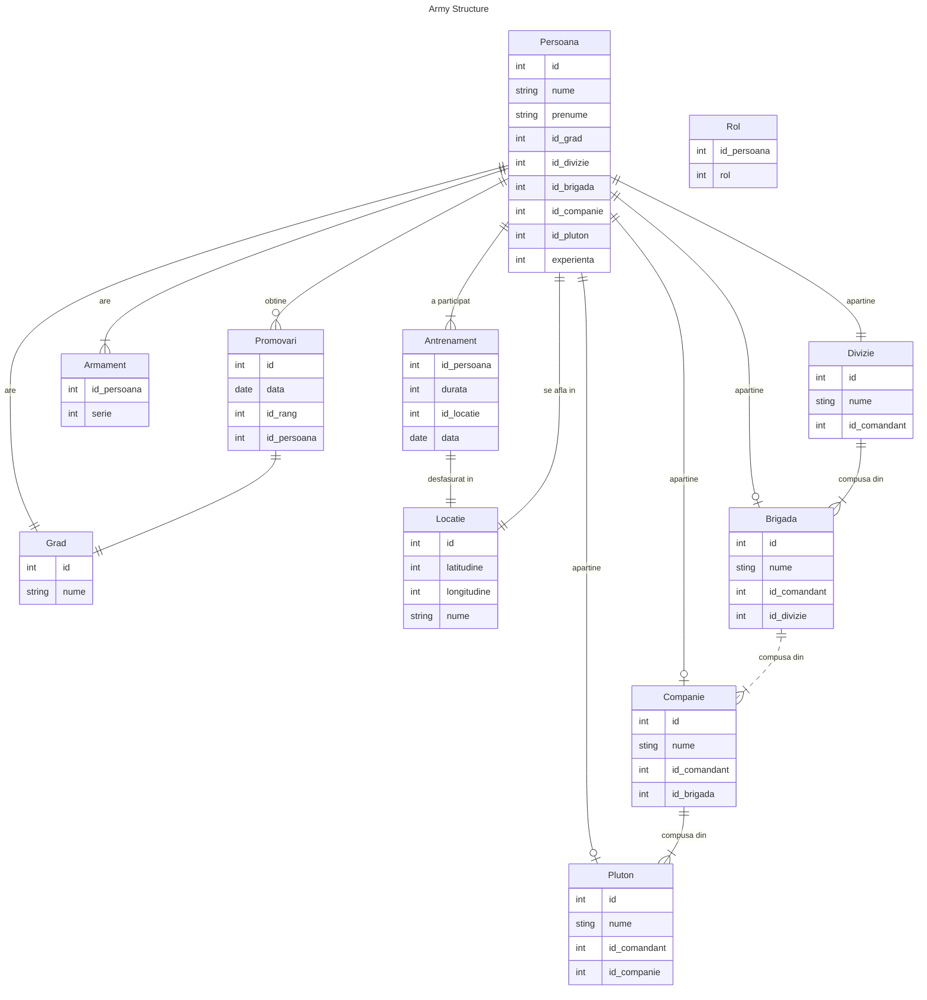

# Army-ERD
## Army Data Wearhouse ERD

Editor used: mermaid live editor
https://mermaid.live/edit

ERD documentatie
https://mermaid.js.org/syntax/entityRelationshipDiagram.html

```mermaid
---
title: Army Structure
---
erDiagram
  
  Persoana{
        int id
        string nume
        string prenume
        int id_grad
        int id_divizie
        int id_brigada
        int id_companie
        int id_pluton
        int experienta
  }
  Grad{
    int id
    string nume

  }
  Promovari{
    int id
    date data
    int id_rang
    int id_persoana
  }
  Armament{
    int id_persoana
    int serie
  }
  Rol{
    int id_persoana
    int rol
  }
  Locatie{
    int id
    int latitudine
    int longitudine
    string nume
  }
  Antrenament{
    int id_persoana
    int durata
    int id_locatie
    date data
  }
  Divizie{
    int id
    sting nume
    int id_comandant
  }
  Brigada{
    int id
    sting nume
    int id_comandant
    int id_divizie
  }
  Companie{
    int id
    sting nume
    int id_comandant
    int id_brigada
  }
  Pluton{
    int id
    sting nume
    int id_comandant
    int id_companie
  }
  Persoana ||--|| Divizie : apartine
  Persoana ||--o| Brigada : apartine
  Persoana ||--o| Companie : apartine
  Persoana ||--o| Pluton : apartine
  Persoana ||--|{ Antrenament : "a participat"
  Antrenament ||--|| Locatie : " desfasurat in"
  Persoana ||--|| Grad : are
  Persoana ||--|{ Armament : are
  Persoana ||--|| Locatie : "se afla in"
  Persoana ||--o{ Promovari : obtine
  Promovari ||--|| Grad : ""
  Divizie ||--|{ Brigada : "compusa din"
  Brigada ||..|{ Companie : "compusa din"
  Companie ||--|{ Pluton : "compusa din"
  
  
```
